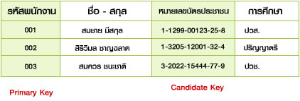

# Key
- - -
**What are Keys in DBMS?**
  KEYS in DBMS is an attribute or set of attributes which helps you to identify a row(tuple) in a relation(table). They allow you to find the relation between      two tables. Keys help you uniquely identify a row in a table by a combination of one or more columns in that table. Key is also helpful for finding unique        record or row from the table. Database key is also helpful for finding unique record or row from the table.

Example:
| Employee ID | FirstName |  LastName |
| :--------: | :--------: | :--------: |
|   11   |   Andrew   |    Johnson   |
|   12   |   Tom   |    Wood   |
|   13   |   Alex   |    Hale   |

In the above-given example, employee ID is a primary key because it uniquely identifies an employee record. In this table, no other employee can have the same     employee ID.

**Why we need a Key?**
  Here are some reasons for using sql key in the DBMS system.

+ Keys help you to identify any row of data in a table. In a real-world application, a table could contain thousands of records. Moreover, the records could be duplicated. Keys in RDBMS ensure that you can uniquely identify a table record despite these challenges.
+ Allows you to establish a relationship between and identify the relation between tables
+ Help you to enforce identity and integrity in the relationship.

**Types of Keys in DBMS (Database Management System)**
  There are mainly Eight different types of Keys in DBMS and each key has it’s different functionality:

  1. Super Key
  2. Primary Key
  3. Candidate Key
  4. Alternate Key
  5. Foreign Key
  6. Compound Key
  7. Composite Key
  8. Surrogate Key

Let’s look at each of the keys in DBMS with example:

+ Super Key – A super key is a group of single or multiple keys which identifies rows in a table.
+ Primary Key – is a column or group of columns in a table that uniquely identify every row in that table.
+ Candidate Key – is a set of attributes that uniquely identify tuples in a table. Candidate Key is a super key with no repeated attributes.
+ Alternate Key – is a column or group of columns in a table that uniquely identify every row in that table.
+ Foreign Key – is a column that creates a relationship between two tables. The purpose of Foreign keys is to maintain data integrity and allow navigation between two different instances of an entity.
+ Compound Key – has two or more attributes that allow you to uniquely recognize a specific record. It is possible that each column may not be unique by itself within the database.
+ Composite Key – is a combination of two or more columns that uniquely identify rows in a table. The combination of columns guarantees uniqueness, though individual uniqueness is not guaranteed.
+ Surrogate Key – An artificial key which aims to uniquely identify each record is called a surrogate key. These kind of key are unique because they are created when you don’t have any natural primary key.
  
refer
> https://www.guru99.com/dbms-keys.html

- - -

**คีย์ (key)** ในการอ้างอิงการค้นหาการแก้ไขเปลี่ยนแปลงข้อมูล หรือการกำหนดความสัมพันธ์ระหว่างข้อมูลจะเกิดขึ้นอย่างมีประสิทธิภาพจะต้องกำหนด คีย์ (Key) ให้กับ Table ก่อน นอกจากนี้การกำหนดคีย์จะทำให้การอ้างอิงและการประมวลผลข้อมูลได้สะดวกขึ้นและยังช่วยประหยัดเนื้อที่ในการจัดเก็บคีย์ที่ใช้ในระบบฐานข้อมูลแบ่งออกได้หลายประเภทดังต่อไปนี้

  1. Primary Key หมายถึง คีย์หลักที่กำหนดจากฟิลด์ที่ไม่มีข้อมูลซ้ำซ้อน (unique) ใน Table เดียวกันโดยเด็ดขาด
     และจะต้องมีค่าเสมอจะเป็นค่าว่าง (Null) ไม่ได้ สามารถนำมาจัดเรียงลำดับและแยกแยะข้อมูลแต่ละรายการออกจากกันได้เป็นอย่างดี
     

         
     

     
  2. Secondary Key หมายถึง คีย์รองโดยโปรแกรม Access จะเรียกคีย์ชนิดนี้ว่า Index (ดัชนี) ซึ่งเป็นคุณสมบิตหนึ่งในการกำหนดคีย์หลัก (Primary Key)
     และยังใช้ Index ในการค้นหาและจัดเรียงรายการข้อมูลที่มีจำนวนมากได้อย่างรวดเร็ว ตัวอย่างเช่น ถ้าต้องการค้นหาฟิลด์ชื่อพนักงานถ้าฟิลด์ดังกล่าวไม่กำหนด Index
     ไว้โปรแกรมจะเริ่มต้นตั้งแต่รายการแรกไปเรื่อย ๆ จนกระทั่งพบดังนั้น ถ้าชื่อพนักงานที่ต้องการค้นหาอยู่รายการท้าย ๆ จะเสียเวลาในการสืบค้นโดยเฉพาะข้อมูลที่มีจำนวนมากๆ
     ถ้ากำหนด Index ให้กับฟิลด์ดังกล่าว ฟิลด์ชื่อพนักงานจะถูกเก็บในแฟ้ม Index ของ DBMS และ จะจัดเรียงชื่อตามลำดับตัวอักษรเมื่อมีการสืบค้นก็จะค้นหาที่แฟ้ม Index
     เพื่อทราบตำแหน่งรายการที่ต้องการและเข้าถึงข้อมูลดังกล่าวได้อย่างรวดเร็ว ฟิลด์ที่กำหนดเป็น Index จะยอมให้ข้อมูลซ้ำกันได้ (Duplicate)
     
  3. Foreign Key หมายถึง คีย์นอกเป็นคีย์ที่เชื่อม Table ที่เกี่ยวข้องหรือมีความสัมพันธ์กัน เช่น ใน Table หลักสูตร กำหนดให้รหัสวิชาเป็น Primary Key
     และทำการเชื่อมโยงไปยัง Table ลงทะเบียนเพื่อต้องการทราบชื่อวิชาและหน่วยกิตที่นักเรียนลงทะเบียนโดยกำหนดฟิลด์รหัสวิชา ใน Table ลงทะเบียนเป็น Foreign Key
     ในลักษณะความสัมพันธ์ One to Many หมายความว่ารหัสวิชา 1 วิชา สามารถให้นักเรียนลงทะเบียนได้มากกว่า 1 คน ดังนั้นจึงมีรหัสซ้ำกันได้ใน Table ลงทะเบียน
      

         
     

     
  4. Candidate Key หมายถึง คีย์ที่มีคุณสมบัติใกล้เคียงกับคีย์หลัก (Primary Key) หรือสามารถแทนคีย์หลักได้ เช่น ในตารางพนักงาน กำหนดให้รหัสพนักงานเป็นคีย์หลัก ซึ่งมีค่าไม่ซ้ำกัน
     แต่พบว่าหมายเลขบัตรประชาชนของพนักงานก็มีค่าไม่ซ้ำกัน ดังนั้น หมายเลขบัตรประชาชนมีลักษณะเป็น Candidate Key ซื่งสามารถนำมาเป็นคีย์สำรองแทนคีย์หลักได้
      

         
     

     
  5. Compound Key หมายถึง คีย์ที่เกิดจากการรวมข้อมูลหลายฟิลด์ให้มีคุณสมบัติเหมือนคีย์หลัก (มีค่าไม่ซ้ำกันและไม่มีค่าว่าง หรือ null value) เช่น การนำฟิลด์ชื่อพนักงานมารวมกับฟิลด์สกุลของพนักงาน
     ทำให้เกิดเป็นฟิลด์ข้อมูลที่มีค่าไม่ซ้ำซ้อนกัน เราเรียกคีย์ที่เกิดจากการรวมชื่อพนักงานและสกุลว่า Compound Key หรือ คีย์รวม
      

         
     

     
อ้างอิง 
> https://msit5.wordpress.com/2013/09/05/%E0%B8%84%E0%B8%A7%E0%B8%B2%E0%B8%A1%E0%B8%AB%E0%B8%A1%E0%B8%B2%E0%B8%A2%E0%B8%82%E0%B8%AD%E0%B8%87-%E0%B8%84%E0%B8%B5%E0%B8%A2%E0%B9%8C-key-%E0%B9%83%E0%B8%99%E0%B8%90%E0%B8%B2%E0%B8%99%E0%B8%82/

> https://cst.tsu.ac.th/courseonline/course/computer_it/database/key.html
> 
- - -
